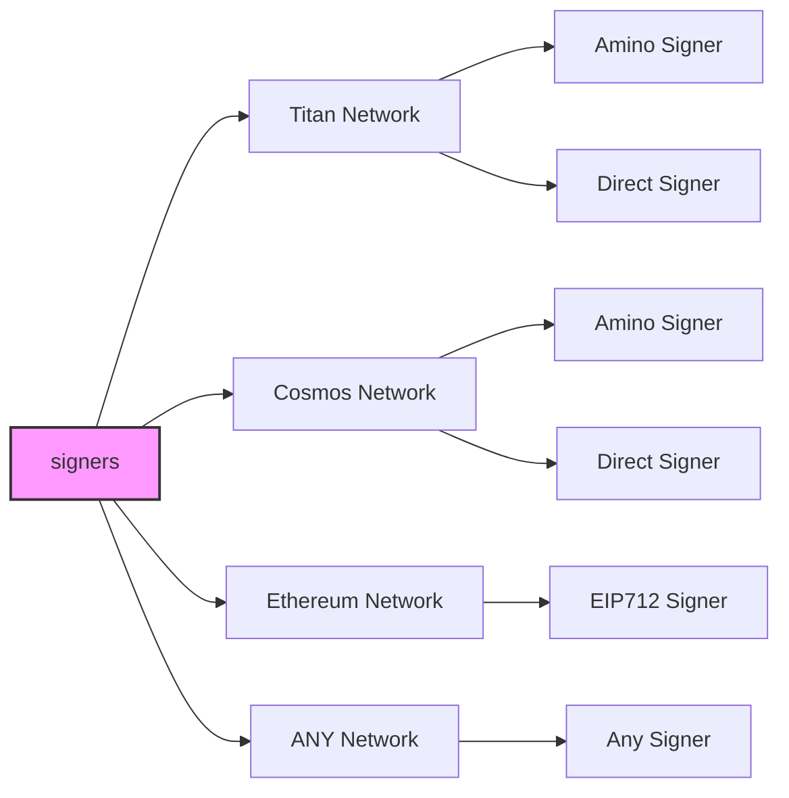
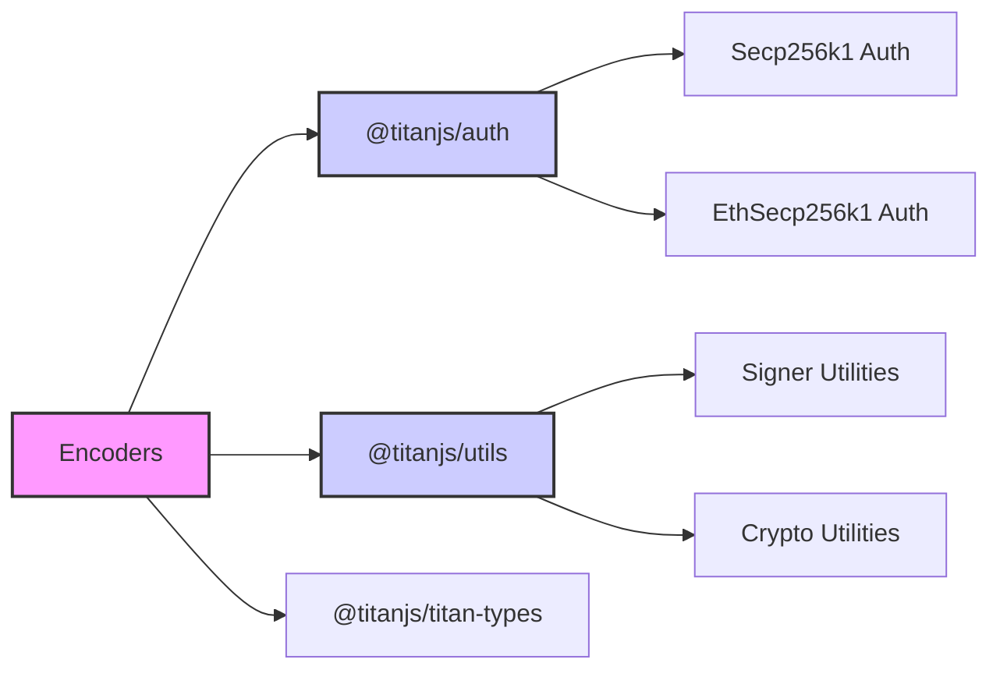

# TitanJS

  

   
   

TitanJS is a universal signing interface for any network. Birthed from the Titan ecosystem for builders. Create adapters for any Web3 network.

Strongly supports the Titan Network.

## Table of Contents

- [Introduction](#titanjs-universal-signing-for-web3)
- [Overview](#overview)
- [Tutorials and Docs](#tutorial-for-building-a-custom-signer)
- [Auth](#auth)
- [Supported Networks](#supported-networks)
  - [Titan Network](#titan-network)
  - [Cosmos Network](#cosmos-network)
  - [Ethereum Network](#ethereum-network)
- [Disclaimer](#disclaimer)

## TitanJS: Universal Signing for Web3

TitanJS is a **universal signing interface** designed for seamless interoperability across blockchain networks. It is one of the **core libraries of the Titan JavaScript Stack**, a modular framework that brings Web3 development to millions of JavaScript developers.

At its core, TitanJS provides a **flexible adapter pattern** that abstracts away blockchain signing complexities, making it easy to integrate new networks, manage accounts, and support diverse authentication protocols and signing algorithms—all in a unified, extensible framework.

## Overview

TitanJS sits at the foundation of the **Titan JavaScript Stack**, a set of tools that work together like nested building blocks:

- **TitanJS** → Powers signing across Titan, Cosmos, Ethereum (EIP-712), and beyond.
- **Titan Kit** → Wallet adapters that connect dApps to multiple blockchain networks.

This modular architecture ensures **compatibility, extensibility, and ease of use**, allowing developers to compose powerful blockchain applications without deep protocol-specific knowledge.

### Visualizing TitanJS Components

The diagram below illustrates how TitanJS connects different signer types to various network classes, showcasing its adaptability for a wide range of blockchain environments.

---

## Tutorials & Documentation

| Topic                            | Documentation |
|----------------------------------|--------------|
| **Building a Custom Signer**     | [Tutorial](/docs/tutorial.md) |
| **Advanced Documentation**       | [View Docs](/docs/) |

---

## Auth

The authentication module is universally applied across different networks.

| Package | Description |
|---------|-------------|
| [@titanjs/auth](/packages/auth/README.md) | Handles authentication across blockchain networks. |
| [Advanced Docs: `Auth vs. Wallet vs. Signer`](/docs/auth-wallet-signer.md) | Explanation of the differences between authentication, wallets, and signers. |

---

## Supported Networks

### Titan Network

| Feature | Package |
|---------|---------|
| **Transactions** | [@titanjs/titan](/networks/titan/README.md) |
| **Titan Types** | [@titanjs/titan-types](/networks/titan-msgs/README.md) |

### Cosmos Network

| Feature | Package |
|---------|---------|
| **Transactions** | [@titanjs/cosmos](/networks/cosmos/README.md) |
| **Cosmos Types** | [@titanjs/cosmos-types](/networks/cosmos-msgs/README.md) |

### Ethereum Network

| Feature | Package |
|---------|---------|
| **Transactions** | [@titanjs/ethereum](/networks/ethereum/README.md) |
| **Ethereum Types** | [@titanjs/ethereum-types](/networks/ethereum-msgs/README.md) |

---

## Disclaimer

AS DESCRIBED IN THE LICENSES, THE SOFTWARE IS PROVIDED "AS IS", AT YOUR OWN RISK, AND WITHOUT WARRANTIES OF ANY KIND.

No developer or entity involved in creating this software will be liable for any claims or damages whatsoever associated with your use, inability to use, or your interaction with other users of the code, including any direct, indirect, incidental, special, exemplary, punitive or consequential damages, or loss of profits, cryptocurrencies, tokens, or anything else of value.
