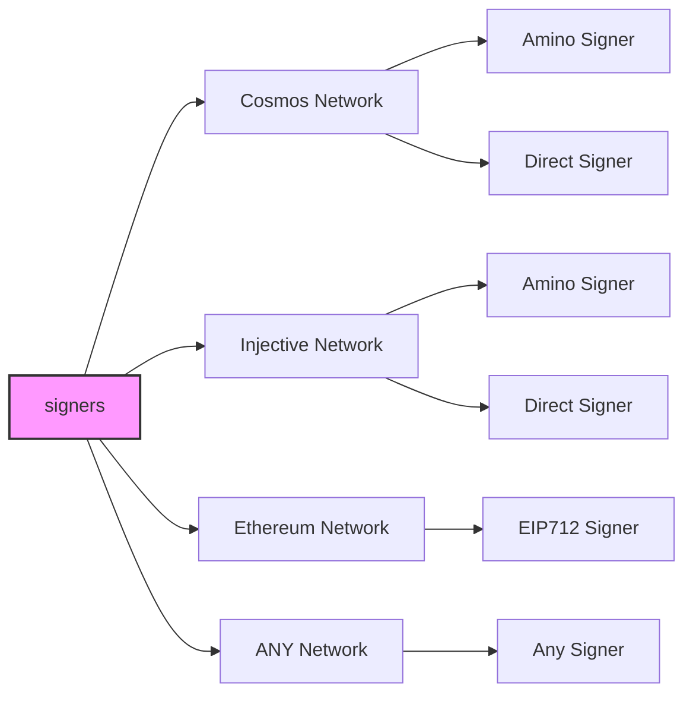
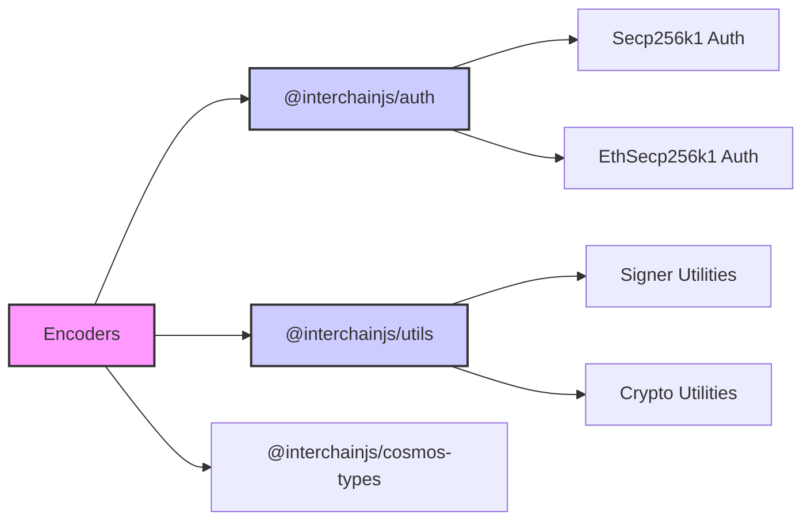

# TitanJS

A single, universal signing interface for any network. Birthed from the titan ecosystem for builders. Create adapters for any Web3 network.

## Table of Contents

- [Introduction](#titanjs-universal-signing-for-web3)
- [Overview](#overview)
- [Tutorials and Docs](#tutorial-for-building-a-custom-signer)
- [Auth](#auth)
- [Supported Networks](#supported-networks)
  - [Cosmos Network](#cosmos-network)
  - [Injective Network](#injective-network)
  - [Ethereum Network](#ethereum-network)
- [Titan JavaScript Stack ⚛️](#titan-javascript-stack-⚛️)
- [Credits](#credits)
- [Disclaimer](#disclaimer)

## TitanJS: Universal Signing for Web3

[TitanJS](https://hyperweb.io/stack/titanjs) is a **universal signing interface** designed for seamless interoperability across blockchain networks. It is one of the **core libraries of the [Titan JavaScript Stack](https://hyperweb.io/stack)**, a modular framework that brings Web3 development to millions of JavaScript developers.

At its core, TitanJS provides a **flexible adapter pattern** that abstracts away blockchain signing complexities, making it easy to integrate new networks, manage accounts, and support diverse authentication protocols and signing algorithms—all in a unified, extensible framework.

## Overview

TitanJS sits at the foundation of the **[Titan JavaScript Stack](https://hyperweb.io/stack)**, a set of tools that work together like nested building blocks:

- **[TitanJS](https://hyperweb.io/stack/titanjs)** → Powers signing across Cosmos, Ethereum (EIP-712), and beyond.
- **[Titan Kit](https://hyperweb.io/stack/titan-kit)** → Wallet adapters that connect dApps to multiple blockchain networks.
- **[Titan UI](https://hyperweb.io/stack/titan-ui)** → A flexible UI component library for seamless app design.
- **[Create Titan App](https://hyperweb.io/stack/create-titan-app)** → A developer-friendly starter kit for cross-chain applications.

This modular architecture ensures **compatibility, extensibility, and ease of use**, allowing developers to compose powerful blockchain applications without deep protocol-specific knowledge.

### Visualizing TitanJS Components

The diagram below illustrates how TitanJS connects different signer types to various network classes, showcasing its adaptability for a wide range of blockchain environments.

---

## Tutorials & Documentation

| Topic                            | Documentation |
|----------------------------------|--------------|
| **Building a Custom Signer**     | [Tutorial](/docs/tutorial.md) |
| **Advanced Documentation**       | [View Docs](/docs/) |

---

## Auth

The authentication module is universally applied across different networks.

| Package | Description |
|---------|-------------|
| [@interchainjs/auth](/packages/auth/README.md) | Handles authentication across blockchain networks. |
| [Advanced Docs: `Auth vs. Wallet vs. Signer`](/docs/auth-wallet-signer.md) | Explanation of the differences between authentication, wallets, and signers. |

---

## Supported Networks

### Cosmos Network

| Feature | Package |
|---------|---------|
| **Transactions** | [@interchainjs/cosmos](/networks/cosmos/README.md) |
| **Cosmos Types** | [@interchainjs/cosmos-types](/networks/cosmos-msgs/README.md) |
| **Migration from `@cosmjs`** | [Migration Guide](/docs/migration-from-cosmjs.md) |

---

### Injective Network

| Feature | Package |
|---------|---------|
| **Transactions** | [@interchainjs/injective](/networks/injective/README.md) |

---

### Ethereum Network

| Feature | Package |
|---------|---------|
| **Transactions** | [@interchainjs/ethereum](/networks/ethereum/README.md) |

---

## Titan JavaScript Stack ⚛️

A unified toolkit for building applications and smart contracts in the Titan ecosystem

| Category              | Tools                                                                                                                  | Description                                                                                           |
|----------------------|------------------------------------------------------------------------------------------------------------------------|-------------------------------------------------------------------------------------------------------|
| **Chain Information**   | [**Chain Registry**](https://github.com/hyperweb-io/chain-registry), [**Utils**](https://www.npmjs.com/package/@chain-registry/utils), [**Client**](https://www.npmjs.com/package/@chain-registry/client) | Everything from token symbols, logos, and IBC denominations for all assets you want to support in your application. |
| **Wallet Connectors**| [**Titan Kit**](https://github.com/hyperweb-io/titan-kit)beta, [**Cosmos Kit**](https://github.com/hyperweb-io/cosmos-kit) | Experience the convenience of connecting with a variety of web3 wallets through a single, streamlined interface. |
| **Signing Clients**          | [**TitanJS**](https://github.com/hyperweb-io/titanjs)beta, [**CosmJS**](https://github.com/cosmos/cosmjs) | A single, universal signing interface for any network |
| **SDK Clients**              | [**Telescope**](https://github.com/hyperweb-io/telescope)                                                          | Your Frontend Companion for Building with TypeScript with Cosmos SDK Modules. |
| **Starter Kits**     | [**Create Titan App**](https://github.com/hyperweb-io/create-titan-app)beta, [**Create Cosmos App**](https://github.com/hyperweb-io/create-cosmos-app) | Set up a modern Titan app by running one command. |
| **UI Kits**          | [**Titan UI**](https://github.com/hyperweb-io/titan-ui)                                                   | The Titan Design System, empowering developers with a flexible, easy-to-use UI kit. |

## Credits

🛠 Built by Hyperweb (formerly Cosmology) — if you like our tools, please checkout and contribute to [our github ⚛️](https://github.com/hyperweb-io)

## Disclaimer

AS DESCRIBED IN THE LICENSES, THE SOFTWARE IS PROVIDED "AS IS", AT YOUR OWN RISK, AND WITHOUT WARRANTIES OF ANY KIND.

No developer or entity involved in creating this software will be liable for any claims or damages whatsoever associated with your use, inability to use, or your interaction with other users of the code, including any direct, indirect, incidental, special, exemplary, punitive or consequential damages, or loss of profits, cryptocurrencies, tokens, or anything else of value.