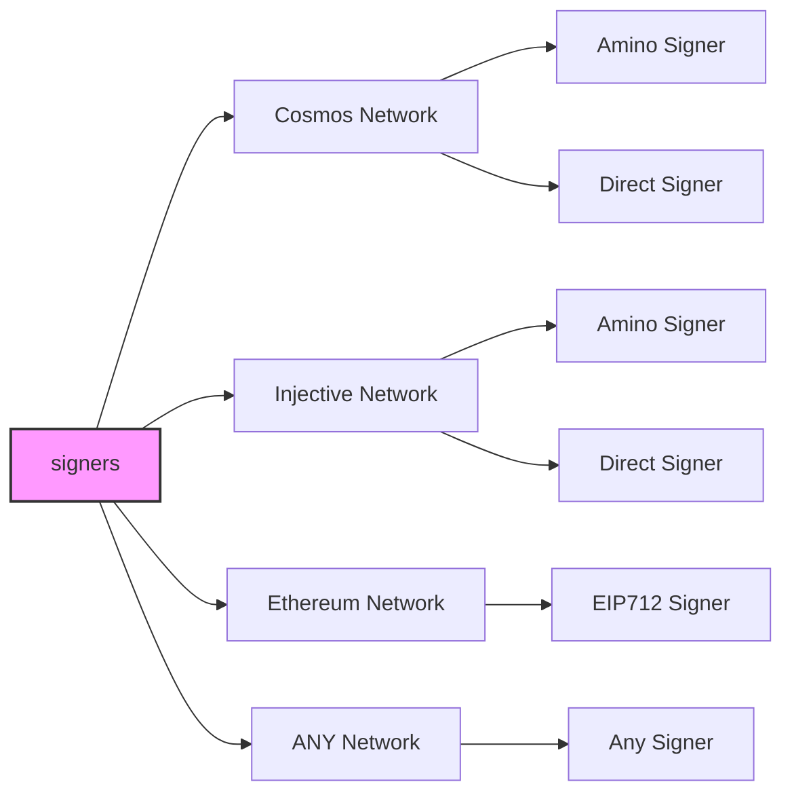
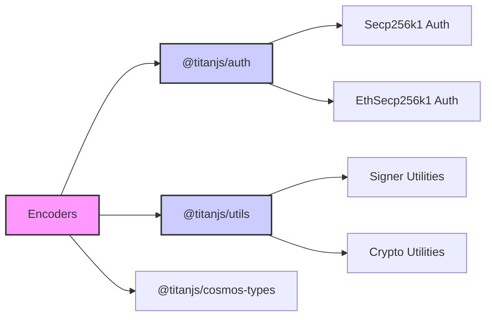

# TitanJS

A single, universal signing interface for any network. Birthed from the titan ecosystem for builders. Create adapters for any Web3 network.

## TitanJS: Titan Signing for Web3

[TitanJS](https://cyberk.io/stack/titanjs) is a **signing interface** designed for seamless interoperability across blockchain networks. It is one of the **core libraries of the [Titan JavaScript Stack](https://cyberk.io/stack)**, a modular framework that brings Web3 development to millions of JavaScript developers.

At its core, TitanJS provides a **flexible adapter pattern** that abstracts away blockchain signing complexities, making it easy to integrate new networks, manage accounts, and support diverse authentication protocols and signing algorithms—all in a unified, extensible framework.

## Overview

TitanJS sits at the foundation of the **[Titan JavaScript Stack](https://cyberk.io/stack)**, a set of tools that work together like nested building blocks:

- **[TitanJS](https://cyberk.io/stack/titanjs)** → Powers signing across Cosmos, Ethereum (EIP-712), and beyond.
- **[Titan Kit](https://cyberk.io/stack/titan-kit)** → Wallet adapters that connect dApps to multiple blockchain networks.
- **[Titan UI](https://cyberk.io/stack/titan-ui)** → A flexible UI component library for seamless app design.
- **[Create Titan App](https://cyberk.io/stack/create-titan-app)** → A developer-friendly starter kit for cross-chain applications. 

This modular architecture ensures **compatibility, extensibility, and ease of use**, allowing developers to compose powerful blockchain applications without deep protocol-specific knowledge.

### Visualizing TitanJS Components

The diagram below illustrates how TitanJS connects different signer types to various network classes, showcasing its adaptability for a wide range of blockchain environments.

