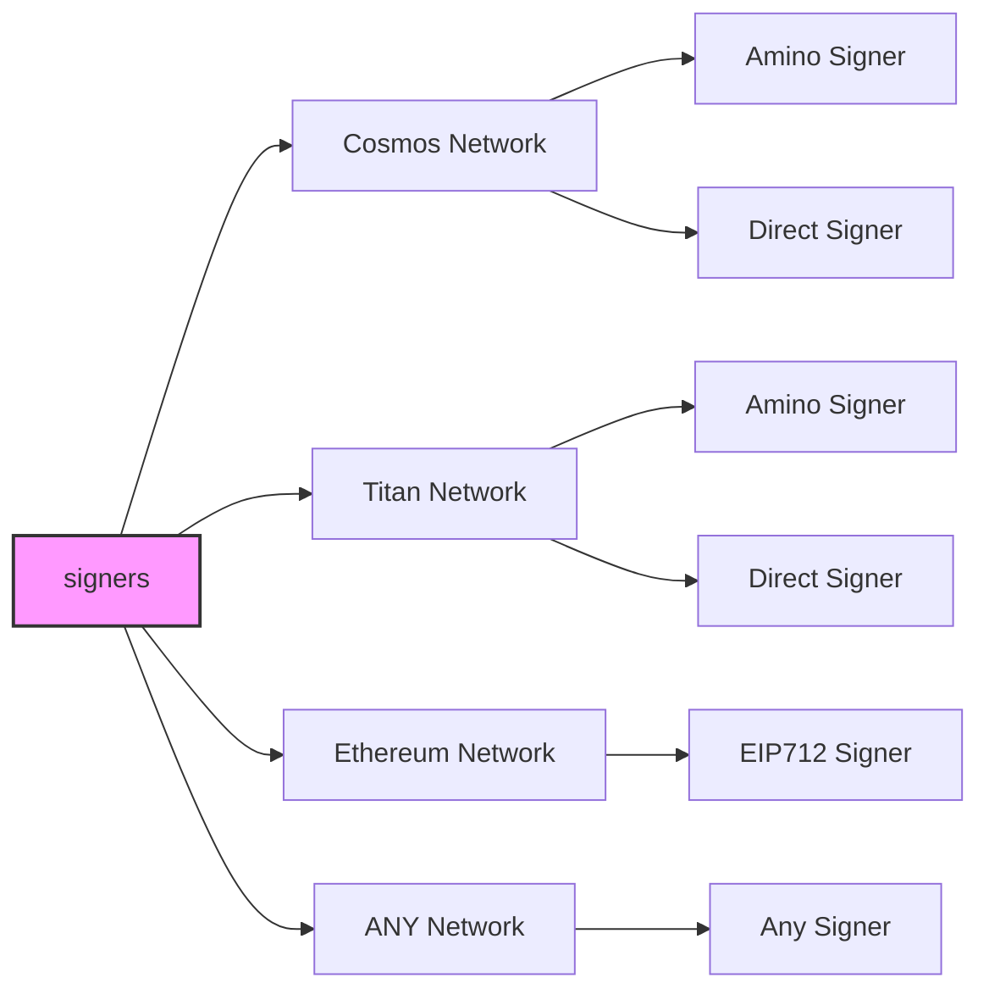
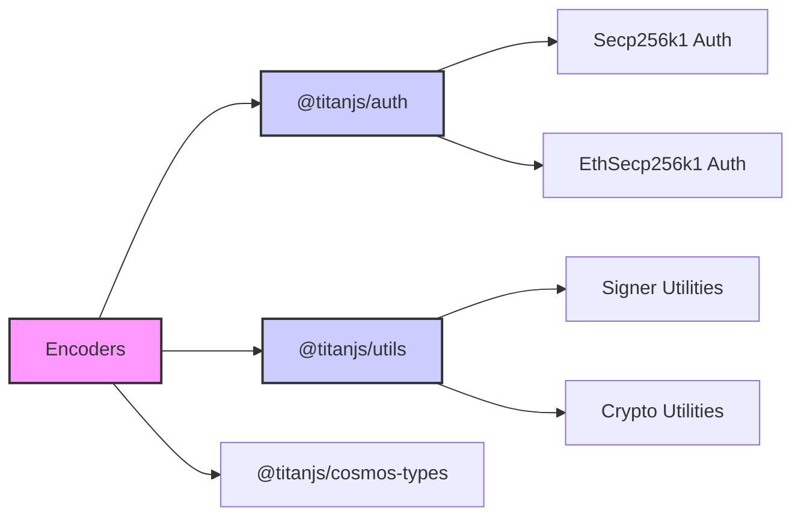

# TitanJS

A single, universal signing interface for any network. Birthed from the titan ecosystem for builders. Create adapters for any Web3 network.

## TitanJS: Titan Signing for Web3

[TitanJS](https://cyberk.io/stack/titanjs) serves as a **signature processing layer** built to enable smooth communication between different blockchain systems. As a **fundamental component of the [Titan JavaScript Stack](https://cyberk.io/stack)**, this modular system empowers Web3 creation for the vast community of JavaScript programmers.

The essence of TitanJS lies in its **versatile connector architecture** which simplifies the complexities of blockchain signatures, enabling straightforward network additions, identity management, and support for various verification methods and signing techniques—all within one cohesive, expandable system.

## Overview

TitanJS sits at the foundation of the **[Titan JavaScript Stack](https://cyberk.io/stack)**, a set of tools that work together like nested building blocks:

- **[TitanJS](https://cyberk.io/stack/titanjs)** → Powers signing across Cosmos, Ethereum (EIP-712), and beyond.
- **[Titan Kit](https://cyberk.io/stack/titan-kit)** → Wallet adapters that connect dApps to multiple blockchain networks.

### Visualizing TitanJS Components

The diagram below illustrates how TitanJS connects different signer types to various network classes, showcasing its adaptability for a wide range of blockchain environments.

